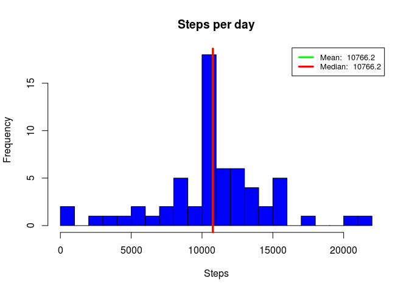

# Reproducible Research: Peer Assessment 1


This assignment focuses on data from a personal activity monitoring device. This device collects data at 5 minute intervals through out the day. The data consists of two months of data from an anonymous individual collected during the months of October and November, 2012 and include the number of steps taken in 5 minute intervals each day.

## Loading and preprocessing the data

Source data for this assessment is in activity.zip file.

The variables included in this dataset are:

- steps: Number of steps taking in a 5-minute interval (missing values are coded as NA)
- date: The date on which the measurement was taken in YYYY-MM-DD format
- interval: Identifier for the 5-minute interval in which measurement was taken

Unzip and load source data:


```r
## Load required packages
library(lubridate)
library(ggplot2)

## Unzip and load the data
unzip("activity.zip")
activityData <- read.csv("activity.csv")

## Format date variable
activityData$date <- as.Date(activityData$date, format="%Y-%m-%d")
```

## What is mean total number of steps taken per day?

In this section we will calculate the total number of steps taken per day to display in a histogram and identify the mean and median number per day.


```r
## Aggregate number of steps by day
stepsTakenPerDay <- aggregate(activityData$steps, by=list(activityData$date), sum, na.rm=TRUE)
names(stepsTakenPerDay)[1:2] <- c("date", "steps")

## Create histogram
hist(stepsTakenPerDay$steps, main = "Steps per day", xlab = "Steps", col = "blue", breaks = 20)

## Calculate the mean and median steps taken per day 
meanStepsPerDay <- round(mean(stepsTakenPerDay$steps), 1)
medianStepsPerDay <- median(stepsTakenPerDay$steps)

## Add mean and median to chart
abline(v=meanStepsPerDay, lwd = 3, col = 'green')
abline(v=medianStepsPerDay, lwd = 3, col = 'red')

## Add legend
legend('topright', lty = 1, lwd = 3, col = c("green", "red"), cex = .8, legend = c(paste('Mean: ', meanStepsPerDay), paste('Median: ', medianStepsPerDay)))
```

 

The mean number of steps taken each day is **9354.2** and the median number of steps is **10395**.

## What is the average daily activity pattern?

In this section we make a time series plot of the average number of steps taken per 5-minute interval, and determine which 5-minute interval, averaged across all of the days, contains the maximum number of steps.


```r
## Aggregate number of steps by interval
meanStepsTakenInterval <- aggregate(activityData$steps, by=list(activityData$interval), mean, na.rm=TRUE)
names(meanStepsTakenInterval)[1:2] <- c("interval", "steps")

## Create time series plot
plot(meanStepsTakenInterval$interval, meanStepsTakenInterval$steps, type="l", col="blue", main="Average Daily Activity Pattern", xlab="5-Minute Intervals", ylab="Average Number of Steps")

## Identify the interval with max steps
maxStepsInterval <- meanStepsTakenInterval[which.max(meanStepsTakenInterval$steps),]

## Add max point to plot and add legend
points(maxStepsInterval$interval,  maxStepsInterval$steps, col = "red", lwd = 3, pch = 19)
legend('topright', col="red", lwd = 3, lty=0, pch=19, legend = c(paste('Maximum Avg Steps Per Day: ', round(maxStepsInterval$steps, 1))))
```

 

Interval **835** had the largest number of average steps per day, which was **206.17**.

## Imputing missing values

In this section, we will impute missing values by replaceing NAs with the mean steps for that interval, and create a new histogram, to see if that results in subtantial changes to the estimates for total daily number of steps.


```r
## First we create a dataframe that takes each line that is missing steps and
## replaces the NA with the mean steps for that interval using a match function
dfImputedSteps <- data.frame(date=activityData$date[is.na(activityData$steps)], interval = activityData$interval[is.na(activityData$steps)], steps=meanStepsTakenInterval[match(meanStepsTakenInterval$interval, activityData$interval[is.na(activityData$steps)]),2])

## Remove NAs from original activity dataset
dfActivityNoNA <- activityData[!is.na(activityData$steps),]

## Combine scrubbed original dataset with imputed dataset
activityDataNoNA <- rbind(dfActivityNoNA, dfImputedSteps)

## Recreate histogram and mean/median
## Aggregate number of steps by day
stepsTakenPerDayNoNA <- aggregate(activityDataNoNA$steps, by=list(activityDataNoNA$date), sum, na.rm=TRUE)
names(stepsTakenPerDayNoNA)[1:2] <- c("date", "steps")

## Create histogram
hist(stepsTakenPerDayNoNA$steps, main = "Steps per day", xlab = "Steps", col = "blue", breaks = 20)

## Calculate the mean and median steps taken per day 
meanStepsPerDayNoNA <- round(mean(stepsTakenPerDayNoNA$steps), 1)
medianStepsPerDayNoNA <- round(median(stepsTakenPerDayNoNA$steps), 1)

## Add mean and median to chart
abline(v=meanStepsPerDayNoNA, lwd = 3, col = 'green')
abline(v=medianStepsPerDayNoNA, lwd = 3, col = 'red')

## Add legend
legend('topright', lty = 1, lwd = 3, col = c("green", "red"), cex = .8, legend = c(paste('Mean: ', meanStepsPerDayNoNA), paste('Median: ', medianStepsPerDayNoNA)))
```

 

Imputing the number of steps resulted in changes to the mean and median number of steps taken per day.  The mean increased from **9354.2** to **10766.2** and the median increased from **10395** to **10766.2**.

## Are there differences in activity patterns between weekdays and weekends?

In this section we will identify if there are differences between weekday and weekend activity.


```r
## Create weekend/weekday factor variable
activityDataNoNA$week <- as.factor(ifelse(weekdays(activityDataNoNA$date) == "Saturday" | weekdays(activityDataNoNA$date) == "Sunday" ,"weekend","weekday"))

## Aggregate the number of steps by interval for weekends and weekdays
meanStepsTakenIntervalDayType <- aggregate(activityDataNoNA$steps, by=list(activityDataNoNA$week, activityDataNoNA$interval), mean, na.rm=TRUE)
names(meanStepsTakenIntervalDayType)[1:3] <- c("daytype", "interval", "steps")

## Plot the daily activity pattern comparing weekends and weekdays
dayTypePlot <- ggplot(meanStepsTakenIntervalDayType, aes(x = interval, y = steps)) +
    geom_line(color="blue") +
    labs(title = "Average Daily Activity Pattern (Weekend vs Weekday)",  
    x = "5-Minute Intervals", y = "Average Number of Steps") + 
    facet_grid(daytype~.)
dayTypePlot
```

 

The plots indicate that people appear to get up earlier and go to bed earlier on weekdays.  They also appear to have more sedintary periods during the day on weekdays, while on weekends there is more activity happening for most of the day.
